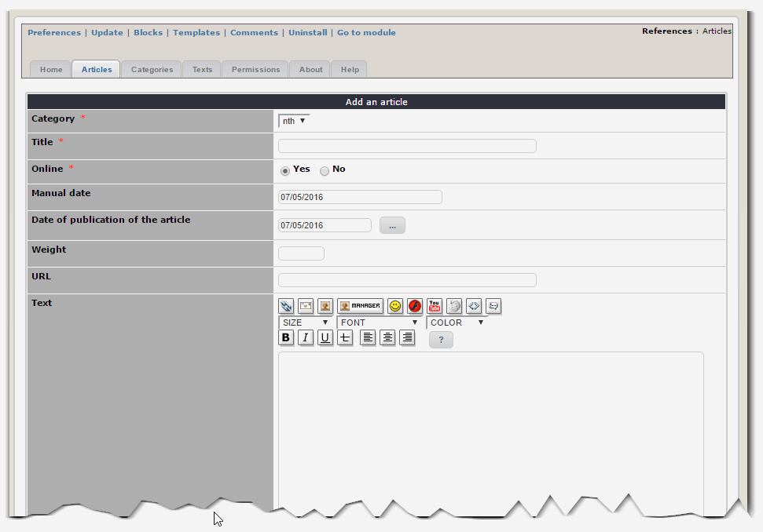
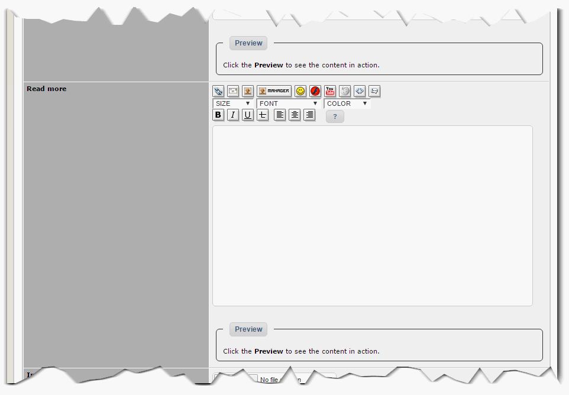
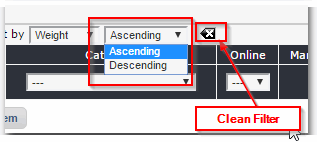

# 2.0 Administration Menu

The Administration Control Panel is accessible from the backoffice of XOOPS. Just click on the module icon in order to get there.

You'll notice that in order to manage the module, you can access different parts of the administration of the module by using a tab system.
 
###Articles (References)

It is in this part of the administration that you can create your Articles/References. Immediately below the tabs, you have a button to add a new article.

In the table, you can see a list of existing References. We find the reference number, title, category, status (online or not), info if the date was set "manually" and a column that allows you to edit or remove a reference.

Let's add a new Reference. When you click on the "Add an Item" button, XOOPS opens an Entry Form for you:

When you add a reference, the input screen presents the following fields
- Category: This is the category to which the reference link
- Title: The title of the reference
- Online: With this option, you can disable referrals, this allows you not to display them while maintaining (if the option is Off).
- Manual Date: Your references may not have been performed on a specific date. This area will allow you to enter a date, such as January 2009
- Date of publication of the article: This area requires you to fill, unlike the previous one, a specific date, in order to sort your references between them when they are part of the same class.
- Weight: This field allows you to manually sort order references against each other
- URL: Enter for example the address of your client's website (regarding the current reference)
- Text: Enter any text in this area that you deem necessary to the description of your reference.

- Key words: This area is visible only if in the module options you have decided to activate keywords. Enter keywords that will best categorize your reference.

- Current image: This area is visible only when editing a reference and that it contains a picture. This allows you to view the image and delete it.
- Stock: This area lets you choose an image from your computer
- Text of the image: this area will be displayed below the image when a visitor to your site clicks on it.

This set of 3 zones is repeated 10 times, then comes:
- Attachment: Lets you attach a file to your reference (e.g. PDF)

Once the reference is created, it is immediately visible on the website (if you have it enabled).

You can also see the article in your table:

Once you have many Refereces, you can sort them by various criteria, and you can decide in what order:

  

###Categories

This tab shows all the categories to which are attached your references.

As in the previous tab, a button placed directly under the tabs allows you to immediately create a new category.

Below, is a list of current categories (number, title, Weight and a column for you to edit or delete a category).

If you click on "Add Item" an entry screen appears to create a new category: 

This screen contains:
- The title of the category
- its weight.

With the weight you can arrange how the categories are sorted. As first displayed are the categories with the lower weight, so if you want to have a certain category as the last, set the weight to something like 9999. 

- The description of the category
- The read permissions on the category

>  Note: When deleting a category, it's up to you to ensure that references are not related to the category.
 
###Texts

With this tab you can specify the text the module will be displayed on its index page.
 
###Permissions

With this tab, you can set the access permissions for each category. Simply choose, for each of your XOOPS groups, their viewing right for each category.
 
###Maintain cache tables
This is not a tab of the administration but a link that is located above the tabs.
By clicking this link, the module will start a series of maintenance tasks and checks on the tables it uses in the database.
The module also uses a system of "cache" (on SQL queries) to improve its performance, click on this link will allow you to regenerate the cache.

