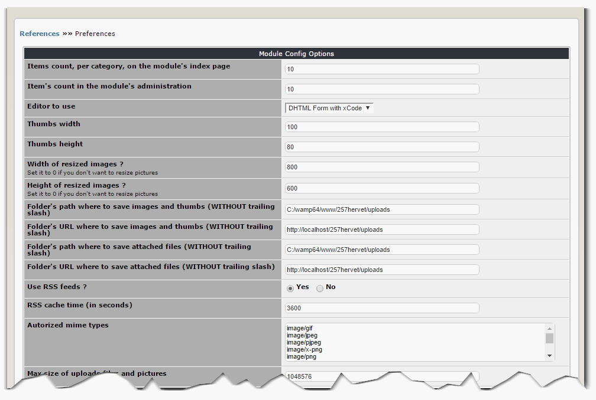

# 3.0 Preferences

You can change the preferences of the module either from its home page in the administration by clicking on the top left on the link labeled "**Preferences**" or by selecting the appropriate link when you hover over the icon of the module.

Some items do not have to be set, while others are very important.
 
####Items per category on the module's Index page
With this option, you specify the maximum number of references to view by Category on the module Index page (i.e. the user view).
 
####Number of elements in the module's administration
This option allows you to choose the maximum number of visible items in the lists of the administration module.
 
####Editor to use
Select from this list the text editor to use to create your references (several Editors are provided with XOOPS as default, but you can add your own, if you are not happy with the default ones.
 
####Thumbnail Width
As mentioned in the listing of the modules Features, the module is able to create thumbnails of each of the 10 images that you attach to each Reference. With this option, you specify the maximum width of the thumbnails.
 
####Thumbnail Height
This option allows you to specify the maximum height of the thumbnails generated by the module.
 
####Folder path where store images and thumbnails (WITHOUT final slash)
Indicate where you want the module saves thumbnails of screenshots. This is a full path that is requested. By default the module uses the "uploads" directory of your site because it is open for writing.
 
####URL folder to save the images and thumbnails (WITHOUT final slash)
Specify the URL where the thumbnails will be stored (see previous item)

####Folder Path to store files attached to items (WITHOUT final slash)
For each Reference it is possible to include an attachment. With this option you specify the path to store the files.
 
####URL folder to save files attached to items (WITHOUT final slash)
Specify the URL where the file attachments will be stored (see previous item).
 
####Use RSS?
With this option you can enable or disable the generation of the RSS module.
 
####RSS Cache Time (in seconds)
If you have enabled the RSS feed generation module (see previous option), then this option allows you to manage the cache time of this flow. Default 1 hour.
 
####MIME types allowed for downloads
This option is used to specify the types of files that can be attached to each reference.
 
####Maximum size of attachments and images
This option limits the size of files attached to the references and the size (in bytes) screenshots. Please note, this option does not overwrite the setting has been done in the php.ini of your website on the maximum size of downloads.
 
####Use the tagging system?
This option allows you to enter for your references, keywords that are then presented in the reference list or in two blocks of the module. This option requires the XOOPS TAG module is installed on your site (you have to install it separately).
 

####Sorting area to use on the index page to sort the references?
This option allows you to choose the sorting area to use to display the references on the index page (the date of creation of the reference of the weight of the reference)
 
####Sort Order
This is a complement to the previous option and allows you to choose the sort direction (ascending or descending)

####config.php
At the root of the module, there is a file called config.php. This file contains some additional options of the module.
These options require a good knowledge of XOOPS and servers. That's why they were in that file and not in the general options of the module.
If you modify this file, make a backup and keep a copy of the original file because an error could result in stopping the operation of the module.

>** Modify this file only if you know what you're doing, or contact us.**

This file contains "DEFINE" of which it is possible to change the values ​​to change the behavior of the module. Here the meaning of the "DEFINE"

| DEFINE | Description |
| -- | -- |
| REFERENCES_CACHE_PATH | Tis option allows you to specify the location of SQL queries cache. The folder pointed to in this option must be writable. If possible, for security reasons, it is advisable to put this folder  outside the Document Root. |
| REFERENCES_THUMBS_PREFIX |When the module generates thumbnails of each image, it uses the same name as the original image, but it adds a prefix defined in this option |
| REFERENCES_SHORTEN_TEXT | 1:4 |
| REFERENCES_METAGEN_MAX_KEYWORDS | 1:4 |
| REFERENCES_METAGEN_KEYWORDS_ORDER | 1:4 |
