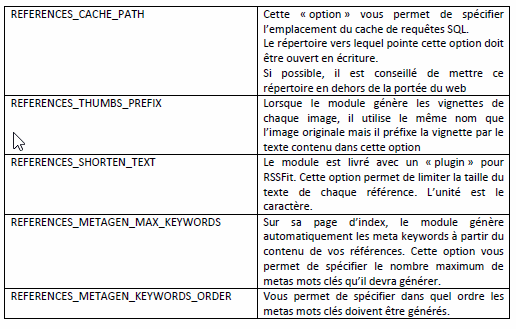

# 3.0 Préférences du module

Vous pouvez changer les préférences du module soit depuis sa page d'accueil dans l'administration en cliquant en haut à gauche sur le lien intitulé "Préférences" soit en sélectionnant le lien adéquate lorsque vous survolez l'icône du module. 

Certaines options n'ont pas forcément besoin  d'être paramétrées alors que d'autres revêtent une certaine importance. 
 
####Nombre d'éléments par catégorie, sur la page d'index du module 
Avec cette option, vous indiquez au module le nombre maximum de références à afficher par catégorie sur la page d’index du module.  
 
####Nombre d'éléments dans l'administration du module 
Cette option vous permet de choisir le nombre maximum d’éléments visibles dans les listes de l’administration du module. 
 
####Editeur à utiliser  
Sélectionnez dans cette liste l’éditeur de texte à utiliser pour créer vos références (ces éditeurs ne sont pas fournis avec le module et doivent être installés par vous-même). 
 
####Largeur des vignettes 
Comme il a été indiqué dans la partie listant les fonctionnalités du module, celui-ci est en mesure de créer les vignettes de chacune des 10 images qu’il est possible de joindre à chaque référence. Avec cette option, vous indiquez la largeur maximale des vignettes. 
 
####Hauteur des vignettes 
Cette option vous permet de spécifier la hauteur maximale des vignettes générées par le module. 
 
####Chemin du dossier où stocker les images et vignettes (SANS slash final) 
Indiquez à quel endroit vous souhaitez que le module enregistre les vignettes des copies d’écran. C’est un chemin complet qui vous est demandé. Par défaut le module utilise le répertoire « uploads » de votre site car celui-ci est ouvert en écriture. 
 
####URL du dossier où sauvegarder les images et vignettes (SANS slash final) 
Spécifiez l’url où seront stockées les vignettes (voir option précédente) 
 
####Chemin du dossier où stocker les fichiers joints aux articles (SANS slash final)  
A chaque référence il est possible de joindre un fichier attaché, avec cette option vous indiquez le chemin où stocker ces fichiers. 
 
####URL du dossier où sauvegarder les fichiers joints aux articles (SANS slash final) 
Spécifiez l’url où seront stockés les fichiers joints aux références (voir option précédente). 
 
####Utiliser les flux RSS ? 
Avec cette option vous avez la possibilité d’activer ou de désactiver la génération du flux RSS du module. 
 
####Temps de cache du flux RSS (en secondes) 
Si vous avez activé la génération du flux RSS du module (voir option précédente), alors cette option vous permet de gérer le temps de cache de ce flux. Par défaut 1 heure. 
 
####Types mime autorisés pour les téléchargements 
Cette option est utilisée pour indiquer les types de fichiers qui peuvent être joints à chaque référence. 
 
####Taille maximale des fichiers joints et des images 
Cette option permet de limiter la taille des fichiers joints aux références ainsi que la taille (en octets) des captures d’écran. Attention, cette option n’écrase pas le paramétrage qui a été fait dans le php.ini de votre site sur la taille maximale des téléchargements. 
 
####Utiliser le système de tags ? 
Cette option vous permet de saisir, pour vos références, des mots clés qui sont ensuite présentés dans la liste des références ou dans 2 blocs du module. Cette option nécessite que le module Xoops TAG soit installé sur votre site (module non livré). 
 
 
####Zone de tri à utiliser sur la page d’index pour trier les références ? 
Cette option vous permet de choisir la zone de tri à utiliser pour afficher les références sur la page d’index (soit la date de création de la référence soit le poids de la référence) 
 
####Ordre de tri 
Cette option est un complément de l’option précédente et vous permet de choisir le sens du tri (par ordre ascendant ou descendant) 
  
####Config.php 
A la racine du module, il existe un fichier qui s’appelle config.php. Ce fichier contient quelques options supplémentaires du module.  

Ces options nécessitent une bonne connaissance de Xoops et des serveurs. C’est pour cela qu’elles ont été placées dans ce fichier et non pas dans les options générales du module. 

Si vous les modifiées, conservez une copie du fichier original car une erreur pourrait entraîner un arrêt du fonctionnement du module. 

Modifiez ce fichier uniquement en connaissance de cause ou contactez-nous. 
Ce fichier contient des « DEFINE » dont il est possible de changer les valeurs pour modifier le comportement du module. Voila la signification de ces « DEFINE » 

